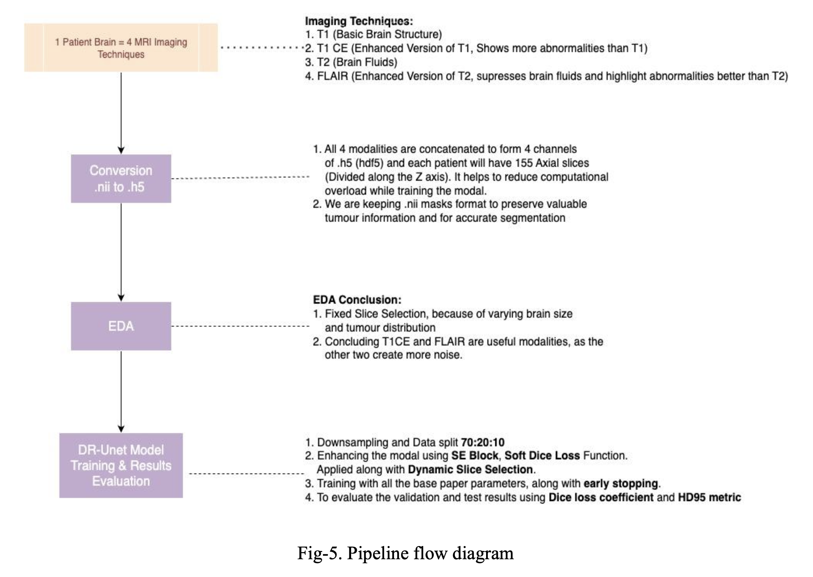
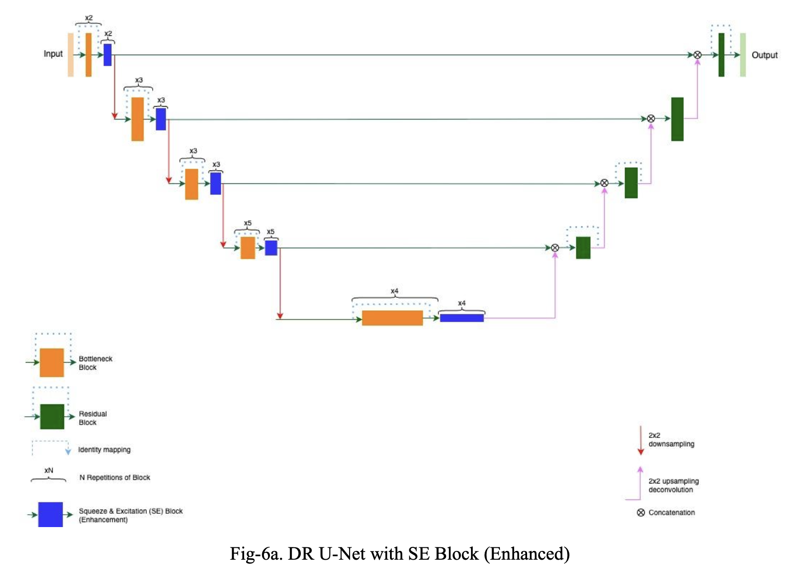
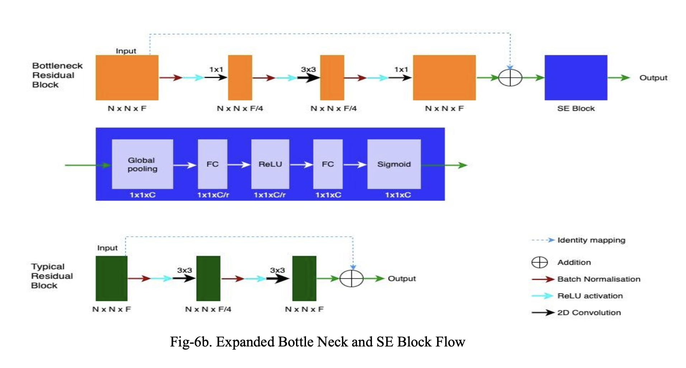

# BTS2025
# Enhanced DR-Unet104 for Multimodal MRI Brain Tumor Segmentation

## 📌 Overview
This project enhances the **Deep Residual U-Net (DR-Unet104)** architecture proposed by Colman et al. (2021) for brain tumor segmentation using multimodal MRI scans from the **BraTS 2020 dataset**.  
Our improvements address limitations in loss functions, attention mechanisms, data handling, and regularization to achieve higher segmentation accuracy and training efficiency.

**Key Enhancements**:
- **Data format**: Converted MRI data from NIfTI to **HDF5** for efficient I/O.
- **Loss function**: Replaced categorical cross-entropy with **Soft Dice Loss** for better class imbalance handling.
- **Attention**: Integrated **Squeeze-and-Excitation (SE) blocks**.
- **Regularization**: Added **early stopping** to reduce overfitting.
- **Focus Modalities**: Used **T1CE** and **FLAIR** for improved tumor and lesion visualization.

---

## 🎯 Objective
Brain tumor segmentation is critical for accurate diagnosis and treatment planning.  
By improving DR-Unet104, we aim to:
1. Increase segmentation accuracy.
2. Reduce computational complexity.
3. Provide an open-source, clinically relevant AI solution.



---

## 📊 Dataset
**BraTS 2020 Dataset** – 369 patient MRI scans, each with:
- **Modalities**: FLAIR, T1, T1CE, T2
- **Mask Labels**:
  - 0: Background
  - 1: Non-enhancing tumor
  - 2: Edema
  - 3: Enhancing tumor (label 4 mapped to 3)

**Preprocessing Steps**:
- Intensity normalization (brightness adjustments).
- 3D MRI → 2D slices (155 per patient).
- Combine modalities into single 4-channel arrays.
- Store in HDF5 format.

---

## 🧠 Model Architecture

| Feature                  | DR-Unet104 (Original)         | Enhanced DR-Unet104 |
|--------------------------|--------------------------------|----------------------|
| **Data Format**          | PNG slices                    | HDF5 (4-channel 2D slices) |
| **Attention**            | None                          | SE Blocks            |
| **Loss Function**        | Categorical Cross-Entropy     | Soft Dice Loss       |
| **Regularization**       | Dropout (0.2)                  | Dropout (0.2) + Early Stopping |
| **Augmentation**         | Basic flips                   | Basic flips          |
| **Evaluation Metrics**   | DSC, HD95                     | DSC, HD95            |



---

## 📈 Results (369 Sample Evaluation)

| Architecture | WT DSC | ET DSC | TC DSC | HD95 WT | HD95 ET | HD95 TC |
|--------------|--------|--------|--------|---------|---------|---------|
| DR-Unet104 (Original) - Val | 0.8862 | 0.6757 | 0.6721 | 12.11 | 47.62 | 15.74 |
| DR-Unet104 (Original) - Test| 0.8673 | 0.7514 | 0.7983 | 10.41 | 24.68 | 21.84 |
| **Enhanced** - Val          | 0.7507 | 0.7209 | 0.6921 | 13.32 | 7.40 | 7.86 |
| **Enhanced** - Test         | 0.7457 | 0.6864 | 0.6838 | 12.72 | 7.90  | 10.97  |

---

## 🛠 Installation & Usage

```bash
# Clone repository
git clone https://github.com/srs-team5/BTS2025.git
cd BTS2025

# Install dependencies
pip install -r requirements.txt

```
